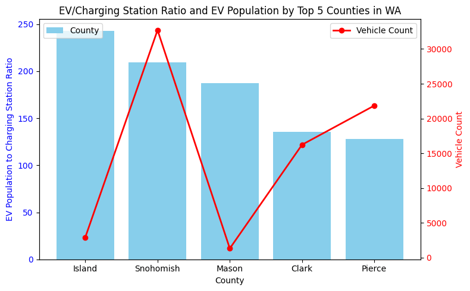

# WA EV Infrastructure Analysis

## Overview

This project explores electric vehicle (EV) infrastructure trends within Washington State using exploratory data analysis techniques in Python. The analysis investigates patterns in EV adoption, charging infrastructure distribution, and regional accessibility to better understand the evolving transportation landscape.

As EV adoption accelerates nationwide, infrastructure planning becomes increasingly important for supporting long-term sustainability goals and transportation accessibility.

---

## Project Objective

The primary objective of this analysis is to examine how EV infrastructure is distributed throughout Washington State and identify trends, gaps, or patterns that may influence future planning and investment decisions.

Key questions explored include:

* How is EV infrastructure distributed geographically?
* Which regions show the highest concentration of EV adoption?
* Are there observable disparities in charging accessibility?
* What trends emerge from the available infrastructure data?

---

## Dataset

The project uses publicly available Washington State EV-related datasets, which may include:

* Electric vehicle registration data
* Charging station infrastructure data
* Geographic or county-level metrics

The data was cleaned, transformed, and analyzed to support exploratory analysis and visualization.

---

## Tools & Technologies

* Python
* Jupyter Notebook
* Pandas
* NumPy
* Matplotlib / Seaborn
* Exploratory Data Analysis (EDA)

---

## Methodology

The project follows a standard data analysis workflow:

1. **Data Collection & Import**

   * Loaded and inspected EV-related datasets

2. **Data Cleaning**

   * Addressed missing values
   * Standardized formatting
   * Prepared geographic and categorical fields

3. **Exploratory Data Analysis**

   * Examined EV adoption trends
   * Compared infrastructure distribution across regions
   * Identified patterns and outliers

4. **Data Visualization**

   * Created charts and visual summaries to communicate findings clearly

---

## Key Insights

* EV infrastructure growth appears concentrated in higher-population regions.
* Certain areas may demonstrate infrastructure gaps relative to adoption trends.
* Geographic analysis highlights the importance of long-term infrastructure planning to support continued EV growth.

Of the 5 counties in Washington with the highest EV-to-charging station ratios, Snohomish, Pierce, and Clark counties have substantially higher EV populations than the others; this might indicate a greater overall need for added EV charging infrastructure within these regions.


---

## Why This Matters

Electric vehicle adoption continues to expand across the United States, increasing the importance of scalable charging infrastructure and equitable access. Analyses like this can help support:

* Urban and regional planning
* Sustainability initiatives
* Infrastructure investment decisions
* Public policy discussions

Research surrounding EV infrastructure expansion has highlighted the growing importance of charging accessibility and long-term infrastructure planning for widespread EV adoption. ([arXiv][1])

---

## Project Structure

```id="2ecjhg"
WA-EV-Infrastructure-Analysis/
│
├── README.md
├── WA EV Infrastructure Analysis.ipynb
├── datasets (see repo)
```

---

## Future Improvements

* Incorporate GIS-based mapping and spatial analysis
* Develop predictive models for future infrastructure demand
* Build an interactive dashboard using Tableau or Power BI
* Analyze correlations between infrastructure and demographic factors

---

## Conclusion

This project demonstrates how exploratory data analysis can be used to investigate real-world infrastructure challenges and uncover meaningful patterns within public datasets. The findings contribute to a broader understanding of EV adoption trends and infrastructure readiness within Washington State.

[1]: https://arxiv.org/abs/2204.03094?utm_source=chatgpt.com "Super-linear Scaling Behavior for Electric Vehicle Chargers and Road Map to Addressing the Infrastructure Gap"
